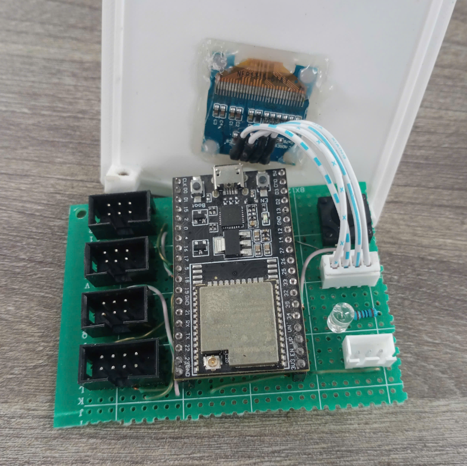
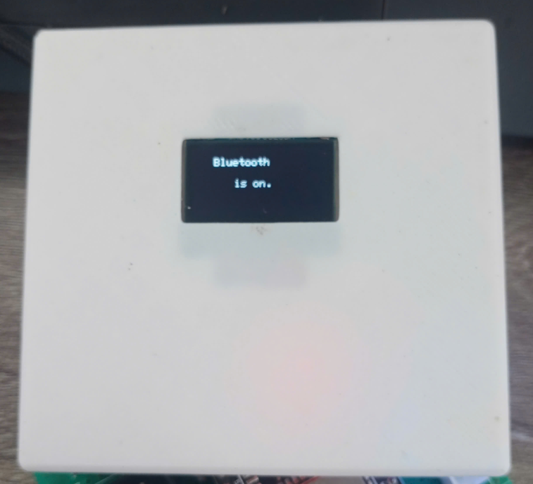
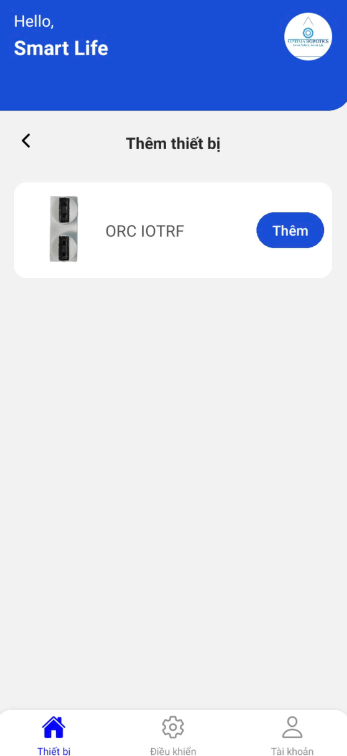
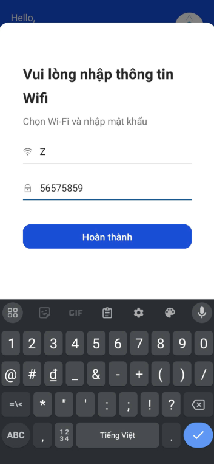
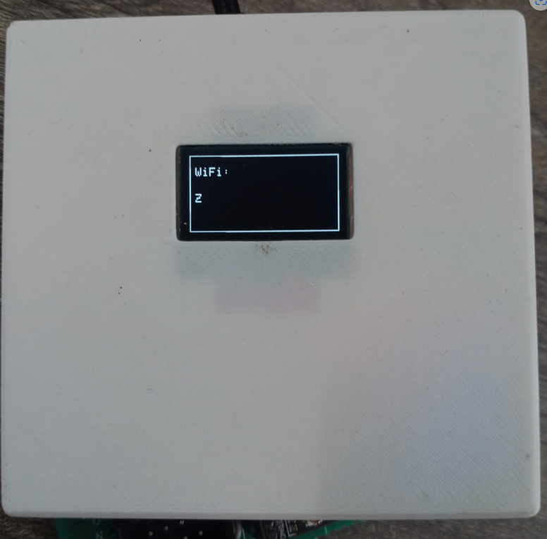
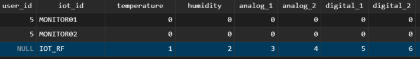

# Bước 1: Kết nối màn hình Oled vào cổng XH4 để quan sát hệ thống.
## Hình ảnh minh họa:
### 

# Bước 2: Nạp chương trình IOT_RF.ino cho board ESP32.

# Bước 3: Test chức năng cấu hình WiFi.
## Khi trên Oled hiển thị dòng chữ Bluetooth is on  mở App Smart App co trong thư mục /App để thực hiện quét và cấu hình WiFi cho thiết bị.


## Sau khi kết nối xong, trên màn hình sẽ hiển thị tên của WiFi đã kết nối. 

# Bước 4: Test chức năng gửi dữ liệu lên database
## Chỉnh sửa các giá trị trong phần code gửi trong hàm loop()
### Code:
```c
if(millis() - send_data_timer > 1000 || send_data_timer == 0)
  {
    send_data_timer = millis();

    if(conn.connected())
    {
      // Chỉnh sửa các giá trị để kiểm tra 
      SendData(1, 2, 3, 4, 5, 6);
    }
    else
    {
      conn.close();
      if(conn.connect(server_addr, 3306, user, password, db)) 
      {
        Serial.printf("Reconnected to database: %s", db);
      }
    }
  }
```
### Ví dụ ở đây các giá trị lần lượt là 1,2,3,4,5,6 thì ở trên bảng iot_monitor cũng sẽ là các giá trị tương ứng.