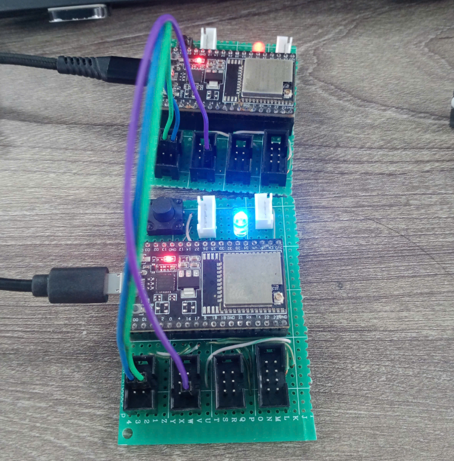
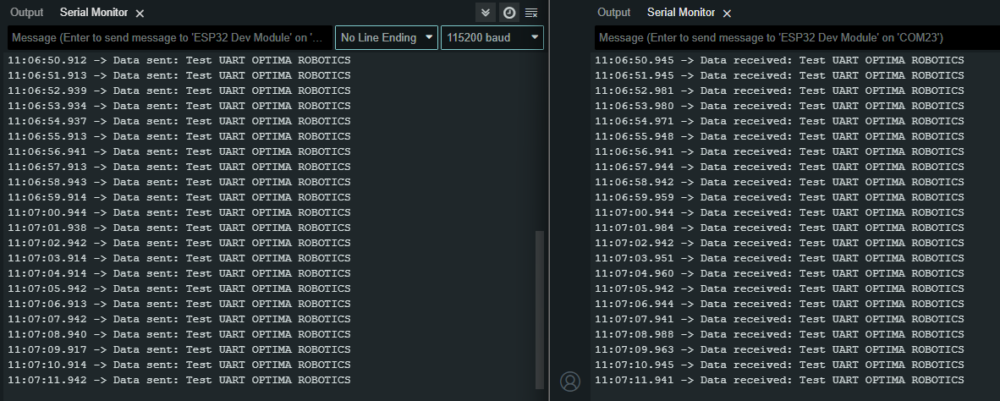

# Bước 1: Nạp code TestReadUART.ino và TestSendUART.ino cho các module esp32.
# Bước 2: Kết nối UART của 2 module lại với nhau(TX-RX, RX-TX, GND-GND).

# Bước 3: Mở Terminal để kiểm tra kết quả:
## Terminal:

